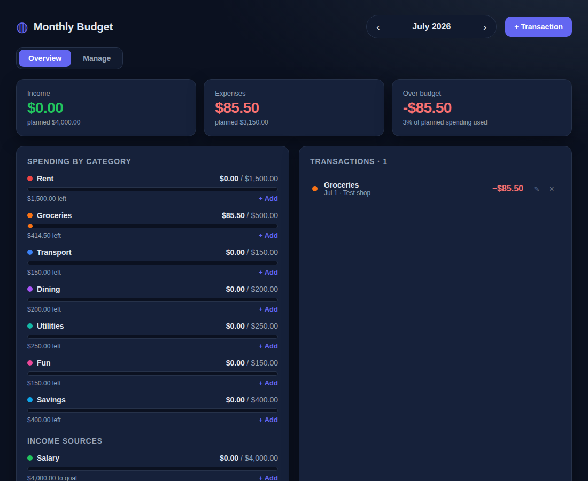

# Monthly Budget

A simple, private month-to-month budgeting web app. Plan a budget for each
category, log your income and expenses, and see at a glance how each month is
tracking against plan. **All data stays in your browser** — there is no server,
no account, and nothing leaves your device.



## Two ways to use it

- **No install — just open a file.** Download [`budget.html`](budget.html) and
  double-click it. It opens in your browser and works completely offline (no
  Node, no npm, no build step, no internet needed). It's the whole app in a
  single self-contained file.
- **Run the dev project.** The `src/` React app below, for development or if you
  want to modify and rebuild it. See [Getting started](#getting-started).

Both store data privately in your browser and have the same features.

## Features

- **Month-by-month view** — step through any month with the arrows; totals and
  progress bars recompute per month.
- **Budget vs. actual** — every expense/income category shows spending against
  its planned budget, with an over-budget indicator.
- **Fast entry** — add a transaction from the header or quick-add straight into
  a category. Edit or delete any entry inline.
- **Custom categories** — add your own income and expense categories, set a
  monthly budget, pick a color, and edit budgets inline.
- **Your currency** — pick from common currencies; amounts format accordingly.
- **Backup & restore** — export your data to a JSON file and import it later or
  on another device. Reset back to the starter setup anytime.
- **Private by design** — data is persisted to `localStorage`; nothing is sent
  anywhere.

## Tech stack

- [React 18](https://react.dev/) + [TypeScript](https://www.typescriptlang.org/)
- [Vite](https://vite.dev/) for dev/build
- Plain CSS — no UI framework
- Browser `localStorage` for persistence

## Getting started

```bash
npm install
npm run dev      # start the dev server (http://localhost:5173)
```

Other scripts:

```bash
npm run build      # type-check and produce a production build in dist/
npm run preview    # serve the production build locally
npm run typecheck  # type-check only
```

## How it works

State lives in a single [`useBudget`](src/hooks/useBudget.ts) hook that keeps
categories and transactions, derives per-month summaries, and syncs to
`localStorage` on every change. A transaction's month is derived from its date,
so switching months simply re-filters the same data — no separate month
buckets to keep in sync.

```
src/
  types.ts                 # shared data types
  storage.ts               # localStorage load/save + starter data
  utils.ts                 # dates, currency, id helpers
  hooks/useBudget.ts       # state + actions + monthly summaries
  components/              # UI: navigator, summary, categories, transactions…
  App.tsx                  # layout, tabs, and the add/edit modal
```

## Privacy

There is no backend. Everything you enter is stored locally in your browser
under the `monthly-budget:v1` key. Clearing your browser data (or using the
in-app **Reset all data** button) removes it. Use **Export backup** to keep a
copy.
